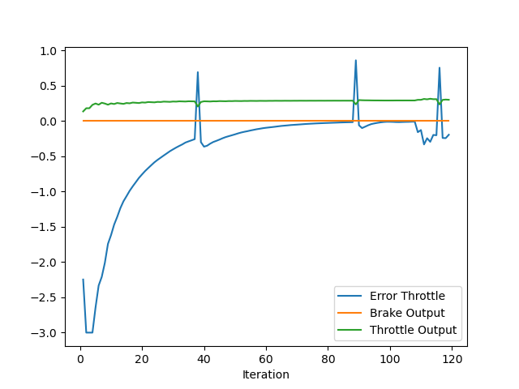
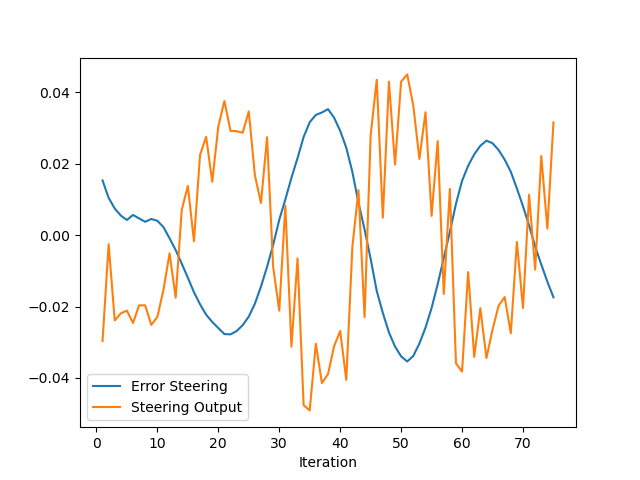

### Plot for Throttle data 

Coefficients are as follows:
1. **Proportional:** 0.06
2. **Integral:** 0.016
3. **Derivative:** 0.005

*Blue Curve:*
Initially error is large but the coefficients are small so there is a dip initially, but as the error accumulates the integral coefficient drives the controller towards the target velocity. Coefficients works together to drive vehicle to the target velocity. Once the target velocity is attained, the vehicle sharply overshoots it, the derivative coefficient makes the controller to reduce the speed and remains at target velocity.

*Green Curve:*
 The throttle output. Rises at start as the car moves from rest towards the target velocity. No sudden spikes can be seen, indicating that the velocity is increaged gradually. there is a dip where the error oversoots zero, which is required as the vehicle at this point is driving at a speed greater than the target.
 
*Orange Curve:*

Brake Curve. Always at zero. Vehicle never applied brake.

### Plot for steer data

Coefficients are as follows:
1. **Proportional:** 1.0
2. **Integral:** 0.2
3. **Derivative:** 5.0

The coefficients are at bit higher side, but the nagnitude of error was small, so to make the vehicle steer the coefficients are kept large. The coefficients are not at all perfect as can be seen form the plot. Tried to find perfect setting but couldn't and the time on virtual machine was over.

*Blue Curve:*

Initial error is large, it moves towards zero but it passes the zero error line and than again curve upwards. This is the overall pattern, I think can be resolved by reducing the integral coefficient or increasing the derivative coefficients because it keeps oscillating around zero mark. The errors accumulates and due to high integral coeffcient it passes over the zero line. Due to Proportional and derivative controller it again changes the direction, but again it passes over zero line and the same pattern repeats.

*Orange Curve:*

It is the steer curve. It follows the same pattern as the blue curve but out of phase. Again the coefficients setting should be adjusted. Once it deviates from the trajectory the vehicle is steered in opposite direction. and the pattern continues.

### Automatic Tuning

For the current coefficient setting for bith throttle and steer several manual trials were used, and it was an exhausting process. Certainly any method for automatic tuning is a must. 

An algorithm like twiddle can be used for automatic tuning, where the parameters are adjusted untill changing them improves the pid controller performance.

While I was using manual trials I thought that it would be great if the pid controller parameters could be dynamically adjusted. Sometimes one needs one more than the other. So there can be a feedback loop which can adjust these parameters dynamically to improve the overall pid performance.

### Pros and cons

**Pros:**

1. Easy to implement
2. They are fast and stable

**Cons:**

1. Sensitive to noise and measurement error, as the output of the controller depends on the chosen error.
2. Large disturbances can cause in huge build up of cumulative error over time, which in turn can cause a high response
3. Requires careful tuning of parameters.
