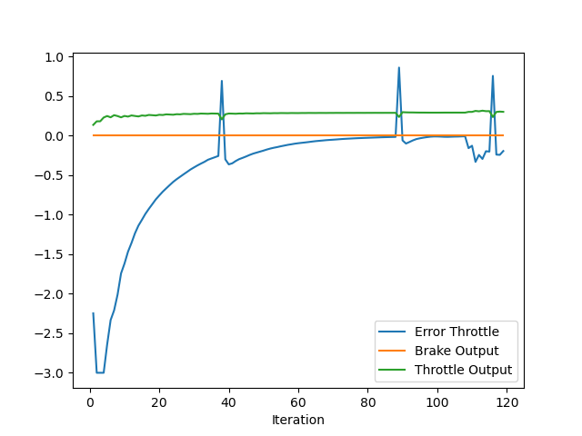
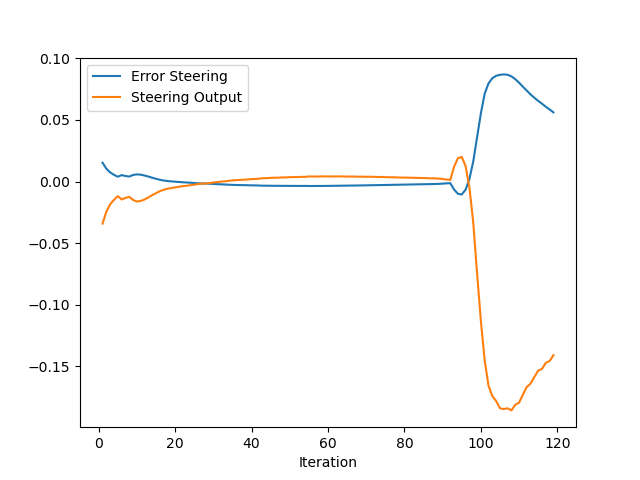

### Plot for Throttle data 

Coefficients are as follows:
1. **Proportional:** 0.06
2. **Integral:** 0.016
3. **Derivative:** 0.005

*Blue Curve:*
Initially error is large but the coefficients are small so there is a dip initially, but as the error accumulates the integral coefficient drives the controller towards the target velocity. Coefficients work together to drive the vehicle to the target velocity. Once the target velocity is attained, the vehicle sharply overshoots it, the derivative coefficient makes the controller to reduce the speed and remains at target velocity.

*Green Curve:*
 The throttle output. Rises at start as the car moves from rest towards the target velocity. No sudden spikes can be seen, indicating that the velocity is increased gradually. There is a dip where the error oversoots zero, which is required as the vehicle at this point is driving at a speed greater than the target.
 
*Orange Curve:*

Brake Curve. Always at zero. Vehicle never applied brakes.

### Plot for steer data

Coefficients are as follows:
1. **Proportional:** 2.0
2. **Integral:** 0.05
3. **Derivative:** 0.0

The coefficients are at a bit higher side, but the magnitude of error was small, so to make the vehicle steer the coefficients are kept large. The coefficients are not at all perfect as can be seen from the plot. Last part of the curve which is way off the zero mark is where the vehicle crashes.

*Blue Curve:*

The error starts small and quickly reduces to zero but then the curve goes a little bit below zero. Initially the error is small and cumulative error is also negligible so it is the proportional coefficient responsible to supply the control. After some time a little bit of error starts accumulating, which very slightly pushes the error towards zero. Mainly it is the proportional coefficient which is affecting the resultant steering control. 

*Orange Curve:*

It is the steer curve- the control calculated by PID controller. Initially the vehicle has to move towards left lane due to vehicle in front in its current lane. That's why there is a control value of about -0.04. As the vehicle starts to follow its trajectory, not much steer is needed, that's why the curve stays near zero value. It almost mirrors the error because the proportional coefficient is considerably larger than the integral coefficient and as the proportional coefficient value is 2.0 the steer control is almost the double in magnitude of error.

### Automatic Tuning

For the current coefficient setting for both throttle and steer several manual trials were used, and it was an exhausting process. Certainly any method for automatic tuning is a must. 

An algorithm like twiddle can be used for automatic tuning, where the parameters are adjusted until changing them improves the pid controller performance.

While I was using manual trials I thought that it would be great if the pid controller parameters could be dynamically adjusted. Sometimes one needs one more than the other. So there can be a feedback loop which can adjust these parameters dynamically to improve the overall pid performance.

### Pros and cons

**Pros:**

1. Easy to implement
2. They are fast and stable

**Cons:**

1. Sensitive to noise and measurement error, as the output of the controller depends on the chosen error.
2. Large disturbances can cause in huge build up of cumulative error over time, which in turn can cause a high response
3. Requires careful tuning of parameters.
